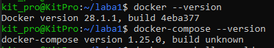
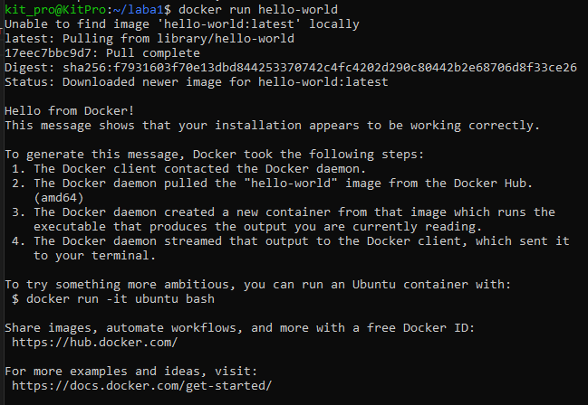
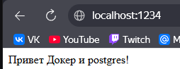

# lab1-dev

#Штуц Данила Михойлович ПИ-431Б

#Отчет по лабораторной работе 1

Изучили теорию, установили на WSL docker и cocker-compose.

Запустили для проверки контейнер hello-world

Написали Dockerfile и docker-compose.yml, запустили для проверки.
